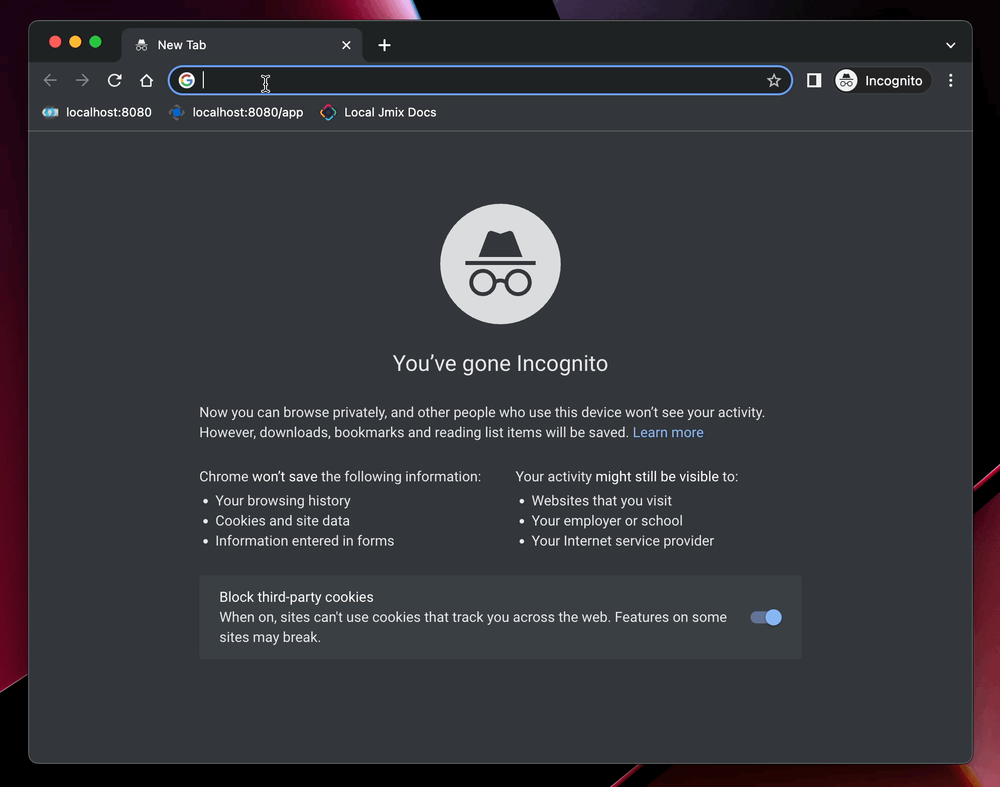

# Sample UI Hub

## Overview

This is an example of integrating multiple Jmix applications (services) into a single starter UI (Hub). 

The Hub main menu is composed of menus of the service applications, taking into account permissions of the logged-in user. When the user clicks on a menu item in Hub, it redirects to the corresponding screen in the service application.

The repository contains the following projects:

- `hub` is a central application which provides common menu collected from service applications
- `customers` and `orders` are service applications connected to the Hub
- `integration` is an add-on providing common functionality for service applications available through the Hub

## Running locally

1. Create different host names for the appplications running on localhost. Add the following lines to your `hosts` file:
    ```
    127.0.0.1       host0
    127.0.0.1       host1
    127.0.0.1       host2
    ```

2. Run Keycloak on port 8180:
    ```
    docker run -p 8180:8080 -e KEYCLOAK_ADMIN=admin -e KEYCLOAK_ADMIN_PASSWORD=admin --name=keycloak quay.io/keycloak/keycloak:18.0.2 start-dev
    ```
    Admin UI will be available at `http://localhost:8180/admin`. Log in as admin/admin.

3. Configure Keycloak
   1. Create `sample-hub` realm.
   2. Create clients:
      - `hub` with `http://host0:8080/` root URL 
      - `customers` with `http://host1:8081/` root URL 
      - `orders` with `http://host2:8082/` root URL 
      
        Set Access Type to `confidential` for all clients.

   3. For all clients, create a mapper on Mappers tab:
      - Type: `User Realm Role`
      - Token Claim Name: `roles`    
   4. Create `system-full-access`, `ui-minimal`, `worker`, `manager` roles.
   5. Create users: 
      - `admin` with `system-full-access` role
      - `alice` with `ui-minimal` and `manager` roles
      - `bob` with `ui-minimal` and `worker` roles
    
        When setting passwords for users, turn off Temporary flag.
        Roles are assigned on the Role Mappings tab.

4. Open terminal in `integration` directory and run `./gradlew publishToMavenLocal` to install the add-on to the local Maven repo.

5. Open `hub` project in IDE and set `spring.security.oauth2.client.registration.keycloak.client-secret` property to the value obtained from the Credentials tab of the `hub` application in Keycloak. Do the same for `customers` and `orders` projects.

6. Run all projects.

## Test usage scenario 

Open `http://host0:8080` in web browser. You will be redirected to Keycloak login form. 

Log in as `alice`. You will land in the Hub application, which will show menus of Customers and Orders applications with items available to user `alice` in this apps.

Click on _Customers App -> Application -> Customers_. The Hub will redirect you to Customers app at `http://host1:8081` and show the Customers browse screen of this app.

You can go back to Hub either using the browser back button or clicking _Go to Hub_ in the main menu.



## Implementation details

The `integration` add-on provides a REST endpoint `/integration/menu` for getting menu structure of the service application, see [MenuController](integration/integration/src/main/java/com/company/integration/menu/MenuController.java). The controller transforms the menu configuration to the collection of DTOs, checking current user permissions for each item. The endpoint is authenticated, see `AuthorizedUrlsProvider` bean in [IntConfiguration](integration/integration/src/main/java/com/company/integration/IntConfiguration.java).

The `customers` and `orders` projects use the `integration` add-on, and therefore automatically expose the `/integration/menu` endpoint. They also create a menu item to go to the Hub application, see `onAfterShow()` method of [MainScreen](customers/src/main/java/com/company/customers/screen/main/MainScreen.java).

Each service application has its own set of roles named `manager` and `worker`, for managing permissions to entities and UI of the application. See [ManagerRole](customers/src/main/java/com/company/customers/security/ManagerRole.java) and the like. The roles are assigned to a user in Keycloak and used when the user is authenticated in an application.

Service applications are registered in Hub using its `integration.appNames` and `integration.appUrls` properties.

The Hub application in `onAfterShow()` method of [MainScreen](hub/src/main/java/com/company/hub/screen/main/MainScreen.java) builds main menu by retrieving it from all registered service applications. [MenuRetriever](hub/src/main/java/com/company/hub/integration/MenuRetriever.java) bean requests the service application's `/integration/menu` endpoint, providing the authentication token which was stored in a session attribute by [AuthenticationSuccessListener](hub/src/main/java/com/company/hub/integration/AuthenticationSuccessListener.java) when the user logged in to the Hub application.

The `integration` add-on also provides the `/integration/logout` REST endpoint for logging out from a service application by a signal from the Hub, see [LogoutController](integration/integration/src/main/java/com/company/integration/logout/LogoutController.java). 

[OAuth2LoginSecurityConfiguration](integration/integration/src/main/java/com/company/integration/oidc/OAuth2LoginSecurityConfiguration.java) configures session management for OIDC-based authentication. It will be included in the next version of the OIDC add-on and will not be needed in this project.